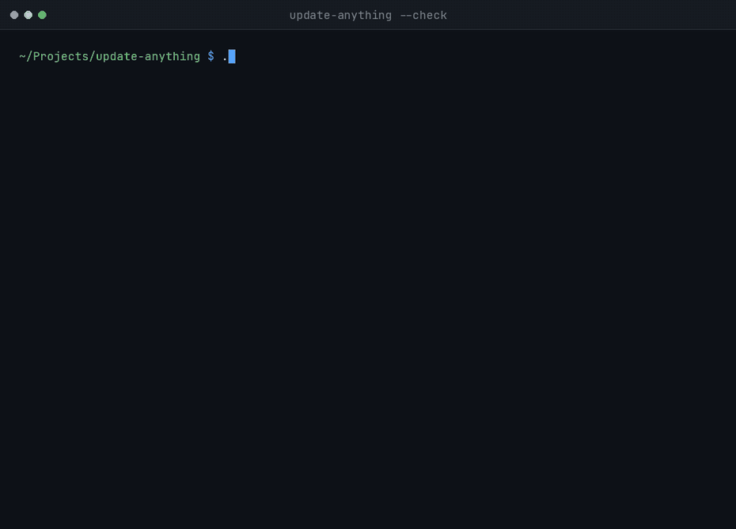

<div align="center">

# update-anything

**One command that updates every package manager you actually have — on any Unix, without assuming which ones those are.**

[](https://github.com/legeeknumero1/update-anything/actions/workflows/ci.yml)
[](tests/run.sh)
[](https://www.shellcheck.net/)
[](#portability)
[](LICENSE)



<sub>A real `--check` run: nothing is modified. Pre-flight checks, then every detected manager — pacman, AUR, Homebrew — followed by the user-space ones running concurrently.</sub>

</div>

---

## What this is

A single bash script. It detects the OS, probes for every supported package
manager with `command -v`, and updates the ones that are actually there.
Nothing is hardcoded as "the" package manager for a platform: a Mac with both
Homebrew and MacPorts gets both, an Alpine container with only `apk` gets only
`apk`, and a machine without `flatpak` never hears about flatpak.

```
pacman (+ AUR: yay, paru, pikaur, trizen, aurman, pamac)   apt   dnf   yum
zypper   apk   Homebrew   MacPorts   FreeBSD pkg   OpenBSD pkg_add
Flatpak   Snap   Nix   cargo (via cargo-binstall when present)   uv
pnpm   bun   npm (global)   pipx
```

The interesting part of a tool like this is not the list. It is what it refuses
to do — see [Threat model](#threat-model).

## Quick start

```sh
git clone https://github.com/legeeknumero1/update-anything
cd update-anything
./install.sh
update-anything --check      # dry run: queries everything, installs nothing
```

There is deliberately no `curl | bash` one-liner. Piping a remote script
straight into a shell is a poor habit to encourage, and doubly so for a tool
that goes on to invoke package managers through `sudo`. Clone it, read it, then
install it.

`install.sh` copies the script into `~/.local/bin` and installs completions into
whichever completion directory it actually finds — bash-completion, a zsh
`$fpath` directory, fish. None are assumed present. `./install.sh --uninstall`
removes everything it put there.

Arch users can build from [`packaging/aur/PKGBUILD`](packaging/aur/PKGBUILD),
which pins the release tarball by checksum and runs the full test suite as its
`check()` step:

```sh
cd packaging/aur && makepkg -si
```

## Usage

```sh
update-anything --check              # dry run, installs nothing
update-anything                      # interactive: previews, then asks
update-anything -y                   # fully unattended (read the warning below)
update-anything --only flatpak,cargo # just these two, ignore the rest
update-anything --no-snap --no-brew  # everything except these
update-anything -y --quiet           # what a cron entry looks like
update-anything --clean --orphans    # also clean caches / remove orphans (asks first)
update-anything --rollback           # diff the last two package snapshots
```

`update-anything --help` lists every flag.

### What `-y` actually means

`-y` is unattended in the real sense: it answers this script's prompts *and*
passes each package manager its own non-interactive flag (`--noconfirm`, `-y`,
`--non-interactive`, `-N`, depending on the manager). Nothing stops for input.

That includes things worth stopping for — a package being removed to resolve a
conflict, a replacement of one package by another, an AUR `PKGBUILD` that
changed since you last read it. Use `-y` only where you trust every configured
source, including your AUR helper's. When you are not sure, run without it and
read each prompt; that is what the interactive mode is for.

Every `-y` run says so on screen before touching anything.

### Exit status

| Code | Meaning |
|---|---|
| 0 | every requested step succeeded, including `--check`, `--help`, `--version` |
| 1 | a step failed, or a pre-flight check refused to start (no network, low disk, low battery, another instance running, run as root, unknown flag) |
| 130 | interrupted |

Set explicitly rather than inherited from whatever ran last, so this is safe in
a cron job or chained with `&&`.

## Threat model

This is the section worth reading. A script that runs `sudo pacman -Syu`
unattended on your machine earns its trust by what it declines to do.

| Risk | Mitigation |
|---|---|
| Partial upgrade corrupts the system (Arch-class distros explicitly warn against this) | Always a full `-Syu`/`full-upgrade`/`upgrade`, never a scoped package list |
| The script silently answers "yes" to a package manager's own destructive prompt (replace/remove/conflict) | Never without `--yes`. `--yes` is explicitly the unattended mode and does pass `--noconfirm`/`-y`/`--non-interactive`; it prints what it is waiving at the top of every run |
| Two instances race on the package database | `mkdir`-based atomic lock — portable, no `flock` dependency |
| Disk fills mid-transaction | Aborts before starting if free space on `/` is critically low |
| Running as root breaks AUR helpers and Homebrew, or masks `sudo`-scoped intent | Refuses to start as root; calls `sudo` itself, only where a manager needs it |
| Silent data loss from orphan removal or cache cleanup | Both opt-in (`--orphans`, `--clean`); both list what will go and ask first |
| No way to know what changed when something breaks | A package snapshot and a timestamped log are written *before* anything is touched (`~/.local/share/update-anything/`, purged after 30 days) |
| An offline run leaves package databases half-synced | Aborts before starting if the connectivity check fails |
| `--check` quietly installs something | It installs nothing. Package *indexes* are still refreshed where a manager cannot report what is pending without one (`apt-get update`, `brew update`, `zypper refresh`, `apk update`, `pkg update`); pacman goes through `checkupdates`, which syncs a temporary database instead |
| Power loss mid-transaction corrupts the package database | Aborts under 10% battery and discharging; warns under 20%. Skipped silently on desktops |
| Hooks execute arbitrary code | Hooks run only from a directory under the invoking user's own `$HOME`, as that user, never elevated. Non-executable files are skipped with a warning rather than run |
| A webhook exfiltrates data | Nothing is sent anywhere unless `UPDATE_ANYTHING_WEBHOOK_URL` is set by you; the payload is hostname plus pass/fail |
| A slow AUR or Homebrew build is killed by the system sleeping | `--inhibit-sleep` wraps the run in `systemd-inhibit`/`caffeinate` — opt-in; it never re-execs itself unless asked |
| `--snapshot` quietly eats minutes and disk | Still asks for confirmation even when the flag is passed, and only ever tries one detected backend |
| The config file is mistaken for a safe declarative format | Documented as real sourced shell code, same trust level as `hooks.d/`, not a restricted parser |
| `--rollback` mistaken for an automatic downgrade | Deliberately a diff only. No downgrade command is generated or run |
| A held package is upgraded behind your back | Holds are read from each manager and reported, never overridden — see below |

## Held packages

`pacman`'s `IgnorePkg`, `apt-mark hold`, `dnf versionlock`, `brew pin` and
`flatpak mask` are read and listed at the start of a run.

This script never adds a hold and never works around one. That state belongs to
the manager that owns it, and a second copy here would only be a second place to
get it wrong. What it does is stop a held package from being a mystery: without
this, a package simply never moves and nothing says why.

Managers you deselected with `--no-<manager>` are not consulted at all —
`--no-flatpak` has to mean flatpak is not touched, not merely that it goes
un-upgraded.

## Beyond the defaults

Everything here is off unless you ask for it. A plain `update-anything` run
triggers none of it.

**Selecting what runs.** `--only <manager>` is the inverse of
`--no-<manager>`: repeatable, comma-separated, and authoritative when both are
given, so combining them never depends on parse order.

**`-q`/`--quiet`.** Only warnings and errors reach the terminal; the log still
records everything. With the exit status above, that is what makes a cron entry
usable — silent when it worked, loud when it did not.

**Parallelism.** `cargo`, `npm`, `pipx`, `uv`, `pnpm` and `bun` need no
elevation and touch separate trees, so they run concurrently under `--yes` or
`--check`: measured at 2s instead of 6s for three managers taking 2s each.

Only under those two flags, because they are the cases where no step can stop
to ask you something. A backgrounded step has its output in a file, so its
prompt would be asked into that file and the run would stop at a bare cursor —
and every parallel job shares one stdin, so even a visible prompt would be
answered by whichever child read the keystroke first. An interactive run stays
sequential.

System managers are never parallelised at all: they share a package database
and a sudo ticket, and running two at once is the corruption this script exists
to avoid. `--no-parallel` puts everything back in a line.

**Readable output.** A routine upgrade on a Haskell-heavy repo produces 250
lines of version bumps, which pushes every pre-flight result and the summary out
of the scrollback — so the part worth reading is the part that scrolls away. The
terminal gets the first 20 lines and a count; the log always gets all of them,
and `--full` prints everything.

**`--snapshot`.** A system-level restore point before anything is touched, using
the first backend found: `snapper`, `timeshift`, `bectl` (FreeBSD boot
environments), a ZFS root dataset (detected through `findmnt`, not a hardcoded
pool name), or `tmutil` on macOS. It still asks first, since Timeshift can take
minutes and real disk space depending on its backend.

**`--deep-clean`.** Prunes dev and container residue after updating: unused
Flatpak runtimes, dangling Docker/Podman images, `cargo-cache`'s git and
registry caches, Go's build and module cache. Each tool gets its own
confirmation.

**`--audit`.** Runs `arch-audit` if present — a real system-wide CVE check
against installed packages. `cargo audit` runs only when a `Cargo.lock` exists
in the current directory, because it is a project-level tool, not a system
scanner. `npm audit` is not run at all, for the same reason. If neither applies,
it says so rather than pretending to have audited anything.

**`--inhibit-sleep`.** Re-executes once under `systemd-inhibit` (Linux) or
`caffeinate` (macOS), so a lid close does not kill a long AUR build.

**`--rollback`.** Diffs the last two package snapshots. Deliberately just a
diff: generating a correct downgrade command per package — right cached version,
right syntax per manager — is a project of its own, not a flag.

**Hooks.** Executable scripts in
`~/.config/update-anything/hooks.d/pre-update/` and `.../post-update/` run in
filename order, as you, never elevated. Same trust model as pacman hooks or your
shell rc files.

**Config file.** `~/.config/update-anything/config` is sourced as shell code
before flags are parsed, so flags always win. Copy `config.example` to get
started — it documents every toggle.

**Webhook.** Set `UPDATE_ANYTHING_WEBHOOK_URL` for a one-line status ping
(hostname plus outcome) at the end of a run. Unset by default.

**Post-update.** If `needrestart` is installed, services still holding outdated
libraries in memory are listed, with an offer to restart just those — rather
than only flagging "reboot needed" for kernel updates.

**Metered connections.** On Linux, `nmcli` is asked whether the active
connection is metered, and you get a warning before a large download. No macOS
equivalent is faked: there is no reliable CLI signal for it there, so it is
simply not checked.

## Tests

```sh
./tests/run.sh              # 42 cases, 69 assertions
./tests/run.sh safety       # only cases whose name matches
```

Nothing in the suite updates anything. Each case runs the script against a
throwaway `HOME` with **stub package managers** on `PATH`: every "update" is a
shell script that records how it was called and exits 0, and `sudo` is stubbed
too, so the suite never elevates anything and never reaches the network.

That is what makes the safety properties testable rather than merely asserted —
that `--check` queries without mutating, that `--no-<manager>` stops a manager
being consulted at all, that a second instance refuses to start, that the lock
is released on a clean exit, and that a folded output list is still complete in
the log.

### Portability

The script is written to **bash 3.2** — no associative arrays, no `mapfile`, no
`${var,,}`, no `local -n` — because that is the bash macOS still ships. CI runs
the suite on **Ubuntu and macOS**; a Linux-only pipeline could not prove that
claim. Two further gates fail the build on bash 4+ syntax and on hardcoded home
directories, and ShellCheck runs at `-S style`, its strictest level, pinned to a
fixed version so the gate cannot move on its own.

## Design decisions

The three trade-offs that shaped this, each with the options that were rejected
and why:

- [bash 3.2 as the baseline](docs/adr/0001-bash-3.2-as-the-baseline.md) — why not Python, Go, or a newer bash
- [Report package holds, never reimplement them](docs/adr/0002-report-holds-never-reimplement-them.md) — why this tool owns no hold state of its own
- [Parallelism limited to user-space managers](docs/adr/0003-parallelism-limited-to-user-space-managers.md) — why system managers stay in a line
- [One sudo ticket, protected by the run order](docs/adr/0004-one-sudo-ticket-owned-by-the-run-order.md) — why Homebrew decides where every other manager runs
- [`--yes` is unattended, or it is nothing](docs/adr/0005-yes-is-unattended-or-it-is-nothing.md) — why the strongest safety claim was given up, and what replaced it

## Contributing

Adding a package manager is the most useful contribution, and
[CONTRIBUTING.md](CONTRIBUTING.md) walks through the four places a new one
touches. Security issues go through [SECURITY.md](SECURITY.md).

## License

GNU General Public License v3.0 — see [LICENSE](LICENSE).
